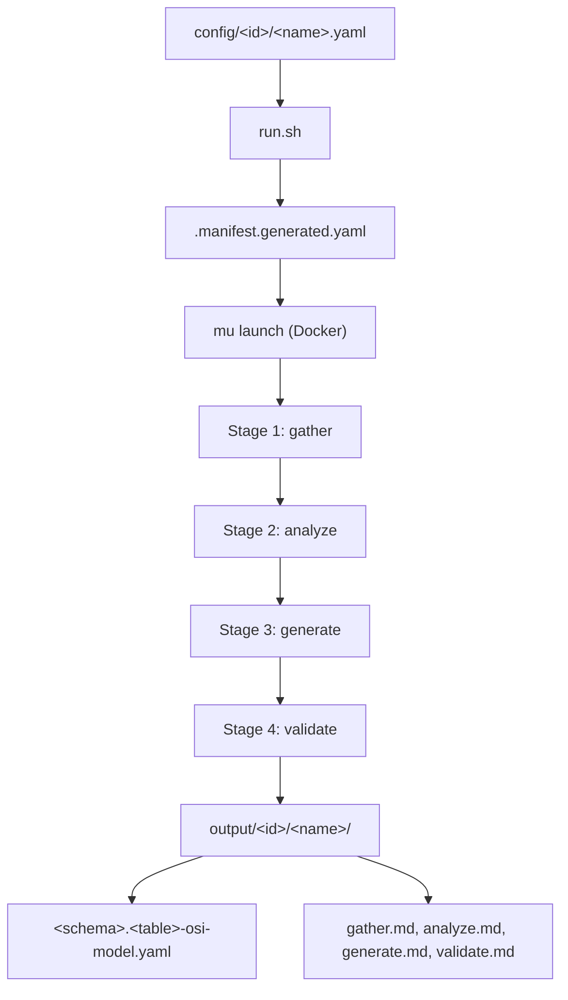

# OSI Semantic Model Mission

## Context

The [OSI (Open Semantic Interchange)](https://github.com/open-semantic-interchange/OSI) spec defines a vendor-agnostic YAML/JSON format for semantic models — datasets, fields, relationships, metrics, and AI context. This mission mirrors the structure of [missions/table-metadata/](missions/table-metadata/) but produces a machine-readable OSI YAML file instead of a markdown metadata document.

## Mission Architecture



## Directory Structure

```
missions/semantic-model/
  manifest.yaml            # Static template (same pattern as table-metadata)
  run.sh                   # Launcher — assembles manifest, runs mu, collects artifacts
  CLAUDE.md                # Mission-specific guidance
  .env.local               # Secrets (gitignored)
  config/
    example/
      payment-cogs-audit.yaml   # Example config
  docs/
    creating-a-config.md        # Playbook
    osi-spec-reference.md       # Condensed OSI spec reference for agent context
  output/                       # Committed per-run artifacts
  .workspace/                   # Scratch (gitignored)
```

## Config Format

Closely mirrors [table-metadata config](missions/table-metadata/config/example/payment-cogs-audit.yaml) with a few additions for semantic model scope:

```yaml
target:
  pyspark_url: "https://github.com/gdcorp-dna/repo/blob/main/path/to/job.py"
  lake_table_override: null
  semantic_model_name: null  # auto-derived if omitted

notes: |

sources:
  confluence_pages: []
  alation:
    enabled: true
    search_query: null
    max_queries: 5
  additional_docs: []
```

## Stage Design (4 Stages)

### Stage 1: `gather` — Collect raw evidence

Same as [table-metadata gather](missions/table-metadata/manifest.yaml) (lines 26-187): read PySpark, DAG, checkout git ref, fetch Confluence/Alation, read lake DDLs. Key addition: explicitly enumerate ALL tables referenced (both read and written), and for each, collect column schemas from DDL/lake registry.

### Stage 2: `analyze` — Resolve lineage and map to OSI concepts

- Resolve target table and all upstream tables to lake tables (recursive lineage, same as table-metadata).
- Classify each resolved table as **fact** or **dimension** based on join patterns in the PySpark (tables being joined TO are dimensions; tables being joined FROM are facts).
- Map foreign key relationships from PySpark join conditions (e.g., `df.join(dim_table, on="customer_id")` becomes a relationship).
- Identify candidate **metrics** from aggregation expressions in the PySpark (`SUM`, `COUNT`, `AVG`, etc.).
- For each table/column, determine dimension metadata (`is_time` for date/timestamp columns).
- Output a structured analysis in `analyze.md` plus `RESOLVED_TARGET.json` (same contract as table-metadata).

### Stage 3: `generate` — Produce OSI YAML

Using the analysis, generate `SEMANTIC_MODEL.yaml` conforming to the [OSI core spec v0.2.0.dev0](https://github.com/open-semantic-interchange/OSI/blob/main/core-spec/spec.yaml):

- **Top-level**: `version: "0.2.0.dev0"`, `semantic_model:` array with one model entry
- **`semantic_model[0]`**: `name`, `description`, `ai_context` (with instructions, synonyms, example questions)
- **`datasets[]`**: One per resolved lake table. Each has `name`, `source` (schema.table), `primary_key`, `fields[]`, `description`, `ai_context`
- **`fields[]`**: Per dataset, one per column. Each has `name`, `expression.dialects[{dialect: ANSI_SQL, expression: ...}]`, `description`, `dimension: {is_time: true/false}` where appropriate, `ai_context` with synonyms
- **`relationships[]`**: Derived from PySpark join conditions. Each has `name`, `from`, `to`, `from_columns`, `to_columns`
- **`metrics[]`**: Derived from aggregations. Each has `name`, `expression.dialects[{dialect: ANSI_SQL, expression: ...}]`, `description`, `ai_context`
- **`custom_extensions[]`**: GoDaddy-specific metadata (lake registry path, DAG name, schedule)

Dialect: **ANSI_SQL** only. The model also writes a summary to `generate.md`.

### Stage 4: `validate` — Schema validation and accuracy check

- Parse `SEMANTIC_MODEL.yaml` and validate structure against the OSI JSON schema (embedded in the prompt or referenced from `docs/osi-spec-reference.md`).
- Check all required fields are present (`name` + `expression` for fields, `name` + `source` for datasets, etc.).
- Verify relationship consistency (from/to datasets exist, column counts match).
- Verify no fabricated content.
- Fix issues in-place and report in `validate.md`.

## run.sh

Closely mirrors [table-metadata run.sh](missions/table-metadata/run.sh) (~450 lines). Key differences:
- The final artifact is `SEMANTIC_MODEL.yaml` instead of `TABLE_METADATA.md`
- Output filename: `<schema>.<table>-osi-model.yaml`
- Config parsing is nearly identical (same `pyspark_url`, `lake_table_override`, `notes`, `sources` structure)
- Adds `semantic_model_name` to `INPUT.md` content

## manifest.yaml

Same structure as [table-metadata manifest](missions/table-metadata/manifest.yaml): 4 stages, same repos (source repo + lake), `claude-sonnet-4-6` model. Prompts rewritten for OSI semantic model generation.

## Supporting Files

- **`CLAUDE.md`**: Mission-specific rules (OSI spec is the output contract, ANSI_SQL dialect, PySpark/DAG is source of truth, same recursive lineage rules as table-metadata)
- **`docs/osi-spec-reference.md`**: Condensed reference of the OSI spec schema, field requirements, and a complete example — embedded so agents don't need network access
- **`docs/creating-a-config.md`**: Config playbook (adapted from table-metadata)
- **`.claude/skills/semantic-model-config/SKILL.md`**: Skill for creating configs (mirrors `table-metadata-config`)

## What to Reuse from table-metadata

| Component | Reuse Strategy |
|---|---|
| `run.sh` scaffolding | Copy and adapt (90% identical — config parsing, mu launch, artifact collection) |
| `manifest.yaml` structure | Copy and rewrite prompts |
| Config YAML schema | Nearly identical + `semantic_model_name` field |
| Gather stage prompt | Heavy reuse (same data collection) |
| Analyze stage prompt | Moderate reuse (lineage logic same, but add fact/dim classification + FK extraction) |
| Generate stage prompt | Fully new (OSI YAML output instead of markdown) |
| Validate stage prompt | Mostly new (schema validation instead of 20-section check) |
