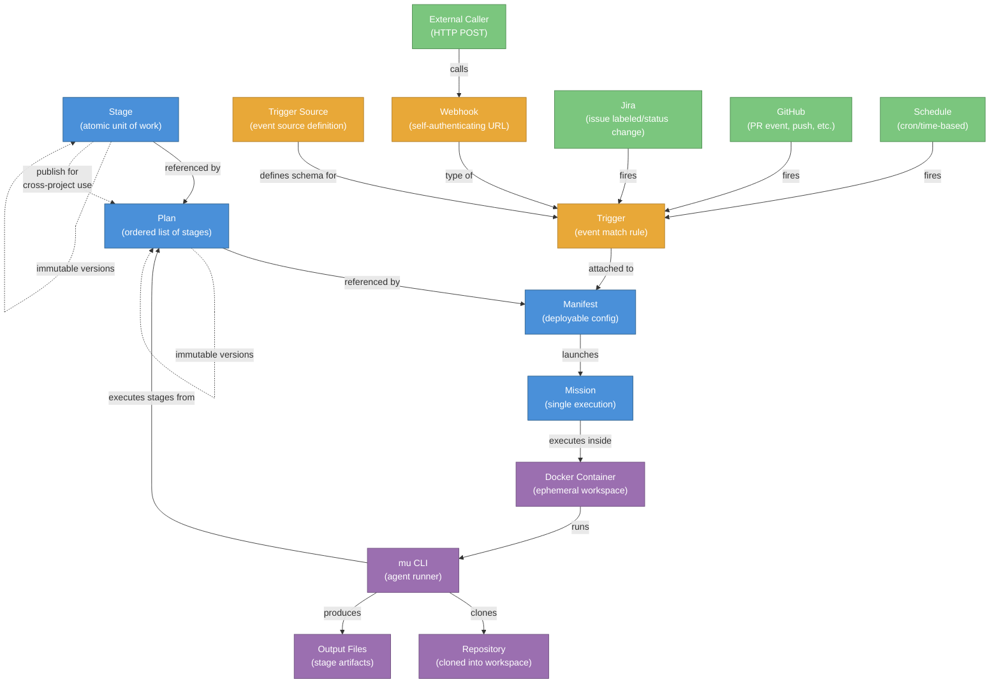
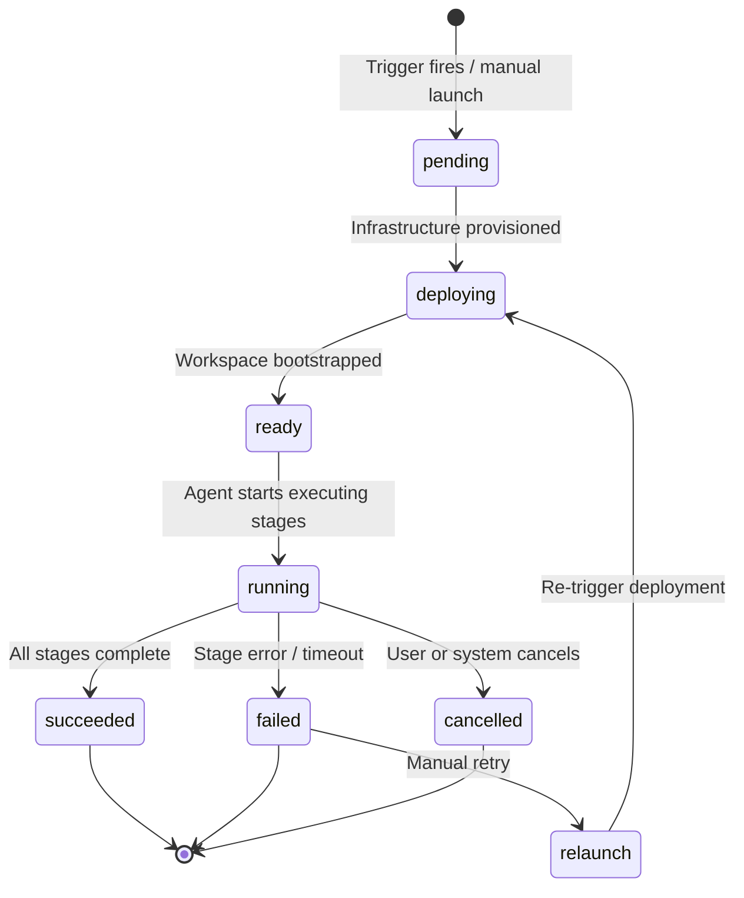
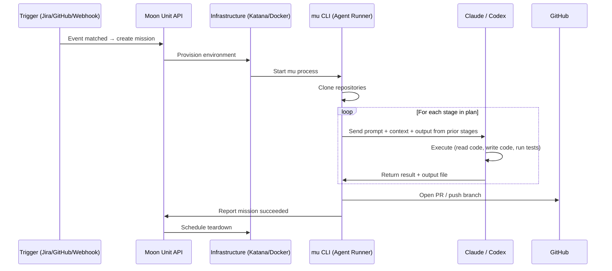
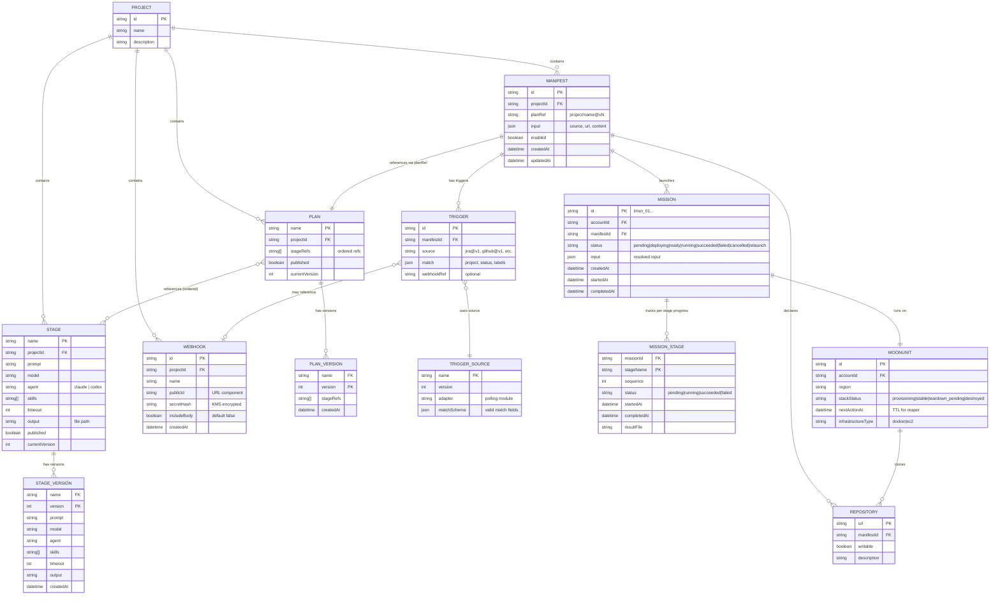
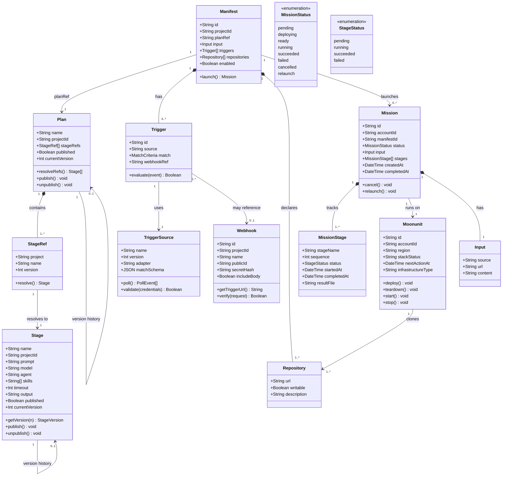
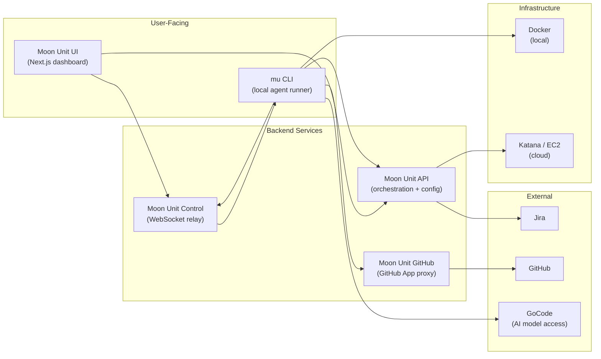

# Moon Units — Concepts, Relationships & Architecture

## Concept Relationship Diagram



## Mission Lifecycle



## Stage Execution Flow



---

## Concepts in Detail

### 1. Stage

A **Stage** is the smallest unit of work in Moon Units — a single instruction given to an AI agent.

**What it contains:**
| Field | Description |
|-------|-------------|
| `name` | Unique identifier within a project |
| `prompt` | The instruction text for the AI |
| `model` | Which AI model to use (e.g., `claude-sonnet-4-6`, `claude-opus-4-6`) |
| `skills` | Optional MCP servers/tools available to the agent |
| `timeout` | Max execution time |
| `output` | File path where the stage writes its result |
| `agent` | Which agent runtime (`claude` or `codex`) |

**Key behaviors:**
- **Versioned** — every update creates a new immutable version; you can pin to a specific version or use latest
- **Publishable** — a stage can be published so other projects can reference it
- **Context-isolated** — each stage starts fresh; it only sees prior stage outputs, not their full conversation history

**Example YAML:**
```yaml
stages:
  - name: research
    prompt: |
      Read the repository structure and the Jira ticket description.
      Summarize the relevant code paths and potential root causes.
    model: claude-sonnet-4-6
    skills: []
    output: research.md

  - name: implement
    prompt: |
      Using the findings in research.md, fix the bug.
      Write tests that cover the fix. Run the test suite.
    model: claude-sonnet-4-6
    skills: []
    output: implement.md
```

**Analogy:** A stage is like one question on an exam — it has clear instructions, a defined scope, and produces one answer.

---

### 2. Plan

A **Plan** is an ordered sequence of stages that together accomplish a multi-step task.

**What it contains:**
| Field | Description |
|-------|-------------|
| `name` | Unique identifier |
| `stages` | Ordered array of stage references |
| `repositories` | Which repos to clone (with read/write permissions) |

**Key behaviors:**
- **Ordered execution** — stages run sequentially; each can read the output files of prior stages
- **Context separation** — each stage gets a fresh agent session (prevents context window exhaustion on long tasks)
- **Cross-project references** — can reference published stages from other projects using ref format: `other-project/stage-name@v3`
- **Versioned** — like stages, plans are immutably versioned

**Ref string format:**
| Ref | Meaning |
|-----|---------|
| `build` | Same project, latest version |
| `build@v3` | Same project, version 3 |
| `other-project/build` | Cross-project, latest |
| `other-project/build@v3` | Cross-project, pinned |

**Built-in plans (provided by the platform):**
| Plan | Stages |
|------|--------|
| `bug-fix` | research → plan → implement → review → address-review → create-pull-request |
| `feature-delivery` | research → build → test → review |
| `research-only` | research |
| `refine-feature-request` | refine-feature-request → update-jira-refine-feature-request |

**Analogy:** A plan is like a recipe — it lists the steps in order, and each step builds on the previous one.

---

### 3. Manifest

A **Manifest** is the deployable configuration that bundles everything needed to launch a mission: which plan to run, which repositories to use, and what events should trigger it.

**What it contains:**
| Field | Description |
|-------|-------------|
| `version` | Schema version (currently `'1'`) |
| `input` | Metadata — source name, URL, content/description of the task |
| `plan` | Plan reference + repository definitions |
| `triggers` | Array of trigger definitions (what events fire this manifest) |

**Example YAML (full manifest file):**
```yaml
version: '1'
input:
  source: security-patch
  url: https://github.com/my-org/my-repo/security/advisories/123
  content: |
    Upgrade lodash from 4.17.20 to 4.17.21 to patch CVE-2021-23337.
    Run tests and open a PR.
plan:
  repositories:
    - url: https://github.com/my-org/my-repo.git
      writable: true
      description: The application repository
    - url: https://github.com/my-org/shared-libs.git
      writable: false
      description: Shared libraries (read-only reference)
  stages:
    - name: patch
      prompt: |
        Read the advisory details in the input. Locate the vulnerable
        dependency, update it, run the test suite, and open a PR.
      model: claude-sonnet-4-6
      skills: []
      output: patch.md
```

**Key behaviors:**
- **References a plan** (via `planRef` for API plans, or inline stages for CLI manifests)
- **Defines repositories** with explicit read/write permissions
- **Attaches triggers** that determine when missions launch automatically
- **Launchable manually** via `mu launch manifest.yml` or API endpoint

**Analogy:** A manifest is like the "program" for an event — it says what's happening (plan), where (repos), and when to start (triggers).

---

### 4. Trigger

A **Trigger** is a rule that matches external events and tells Moon Units when to launch a mission.

**What it contains:**
| Field | Description |
|-------|-------------|
| `source` | Which trigger source to use (e.g., `jira@v1`, `github@v1`) |
| `match` | Criteria that events must satisfy |

**Trigger source types:**

| Source | Status | How it works |
|--------|--------|--------------|
| **Jira** | Implemented | Polls Jira via JQL; matches on project, status, labels |
| **GitHub** | Planned | Reacts to PR events, pushes, issue comments |
| **Schedule** | Planned | Fires on cron/time schedule |
| **Webhook** | Implemented | Self-authenticating HTTP endpoint; push-based |

**Example — Jira trigger in a manifest:**
```yaml
triggers:
  - source: jira@v1
    match:
      project: WIDGET
      status: "Ready for Dev"
      labels: "moonunit,bug"
```

This fires a mission whenever a WIDGET Jira issue moves to "Ready for Dev" status and has both `moonunit` and `bug` labels.

**Example — Webhook trigger:**
```yaml
triggers:
  - type: webhook
    ref: deploy-trigger
```

**Match logic:**
- Exact string matching
- Comma-separated values = OR logic (e.g., `labels: "bug,feature"` matches either)
- Deduplication prevents the same event from launching multiple missions

**Analogy:** A trigger is like an alarm clock — you set the conditions ("when it's 7 AM" / "when a Jira ticket gets labeled"), and it wakes up the mission.

---

### 5. Webhook

A **Webhook** is a special type of trigger — a self-authenticating HTTP URL that external systems can POST to in order to launch missions.

**What it contains:**
| Field | Description |
|-------|-------------|
| `name` | Identifier within the project |
| `publicId` | Public part of the URL |
| `secret` | Encrypted private key (shown once at creation, never again) |
| `includeBody` | Whether to forward the caller's JSON payload as mission input (default: `false`) |

**How it works:**
1. You create a webhook via the API → you get back a one-time `triggerUrl`
2. You give that URL to an external system (CI/CD, Slack bot, monitoring tool)
3. When that system POSTs to the URL, Moon Units verifies the embedded credentials and launches a mission
4. The URL is self-authenticating — no API keys or OAuth needed by the caller

**Why `includeBody` defaults to false:**
To mitigate prompt injection. If an attacker can craft the POST body, they could inject malicious instructions into the mission's input. With `includeBody: false`, only the trigger fires — the mission uses the manifest's predefined input.

**Analogy:** A webhook is like a doorbell with a secret code — anyone who knows the exact address and code can ring it, and it starts the mission.

---

### 6. Mission

A **Mission** is a single execution — one run of a manifest's plan from start to finish.

**What it contains:**
| Field | Description |
|-------|-------------|
| `id` | Unique identifier (e.g., `lmsn_01JQXYZ...`) |
| `status` | Current lifecycle state |
| `stages` | Per-stage progress (status, start/end times, results) |
| `input` | The resolved input data for this run |
| `manifest` | Reference to the manifest that launched it |

**Lifecycle states:**
| State | Meaning |
|-------|---------|
| `pending` | Mission created, waiting for infrastructure |
| `deploying` | Environment being provisioned (Docker or EC2) |
| `ready` | Workspace bootstrapped, repos cloned |
| `running` | Agent actively executing stages |
| `succeeded` | All stages completed successfully |
| `failed` | A stage errored or timed out |
| `cancelled` | Stopped by user or system |
| `relaunch` | Failed mission queued for retry |

**Key behaviors:**
- **Ephemeral** — the workspace is destroyed after completion (unless `--keep-container` is used locally)
- **Observable** — logs stream in real-time via Moon Unit Control (WebSocket)
- **Cancellable** — graceful halt → WebSocket halt → infrastructure deletion
- **Auto-teardown** — infrastructure deleted after a 2-minute grace period post-completion; a 12-hour safety reaper catches orphans

**Analogy:** A mission is like a single load of laundry — it starts, runs through its cycle, and finishes. The machine (container) gets cleaned out afterward.

---

### 7. Trigger Source

A **Trigger Source** is a system-level definition that describes a type of external event Moon Units can listen for.

**What it contains:**
| Field | Description |
|-------|-------------|
| `name` | Source identifier (`jira`, `github`, `schedule`, `webhook`) |
| `adapter` | The code module that knows how to poll/receive events from this source |
| `matchSchema` | JSON schema defining what `match` fields are valid for this source |
| `version` | Versioned for backwards compatibility |

**Registered trigger sources (seeded at startup):**
| Name | Adapter | Match Fields |
|------|---------|-------------|
| `jira` | Jira REST API poller | `project`, `status`, `labels` |
| `github` | GitHub event handler | (planned) |
| `schedule` | Cron scheduler | (planned) |
| `webhook` | HTTP receiver | (push-based, no polling) |

**Analogy:** If a trigger is the specific alarm you set, the trigger source is the *type* of alarm clock (phone alarm, physical alarm, smart speaker) — it defines what kinds of conditions you can configure.

---

## How Everything Connects — End-to-End Example

**Scenario:** Your team wants Moon Units to automatically fix bugs when a Jira ticket is labeled `moonunit-fix`.

### Step 1: Stages exist (built-in or custom)
The platform provides built-in stages: `research`, `plan`, `implement`, `review`, `address-review`, `create-pull-request`.

### Step 2: Plan references those stages
The built-in `bug-fix` plan chains them: research → plan → implement → review → address-review → create-pull-request.

### Step 3: Manifest ties plan + repo + trigger together
```yaml
# Or via CLI: mu watch --plan bug-fix --repo-rw https://github.com/my-org/my-app --jira-project MYAPP --jira-label moonunit-fix
```

### Step 4: Trigger fires
Someone adds the `moonunit-fix` label to MYAPP-456 in Jira.

### Step 5: Mission launches
Moon Units detects the labeled ticket, creates a mission, provisions a container, clones the repo, and runs through all six stages of `bug-fix`.

### Step 6: Result delivered
A PR appears on GitHub with the fix, tests, and a summary. The mission completes with status `succeeded`.

---

## Entity-Relationship Diagram



## Class Diagram (UML)



---

## Platform Components



| Component | Role |
|-----------|------|
| **mu CLI** | Executes missions locally in Docker; bootstraps workspace, runs stages, reports status |
| **Moon Unit API** | Manages configuration (stages, plans, manifests), tracks missions, handles triggers, provisions infrastructure |
| **Moon Unit Control** | Real-time WebSocket relay for log streaming, live status, and commands (instruct/halt) |
| **Moon Unit GitHub** | GitHub App that proxies authenticated GitHub operations on behalf of the platform |
| **Moon Unit UI** | Next.js dashboard for browsing missions, viewing logs, and managing configuration |
