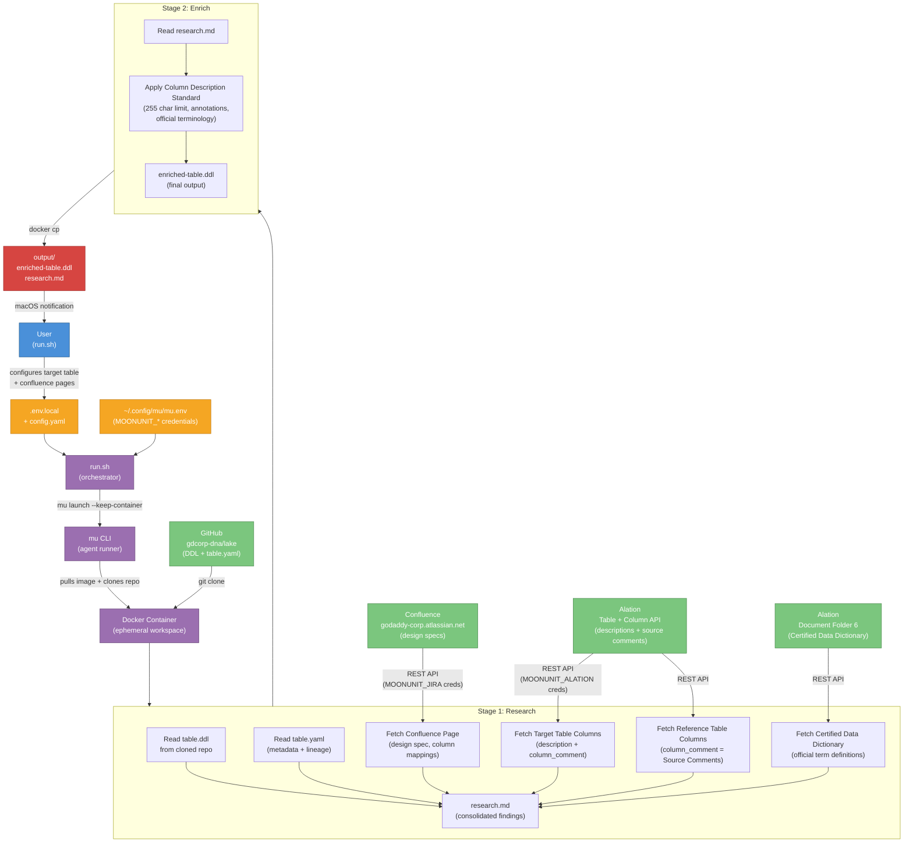
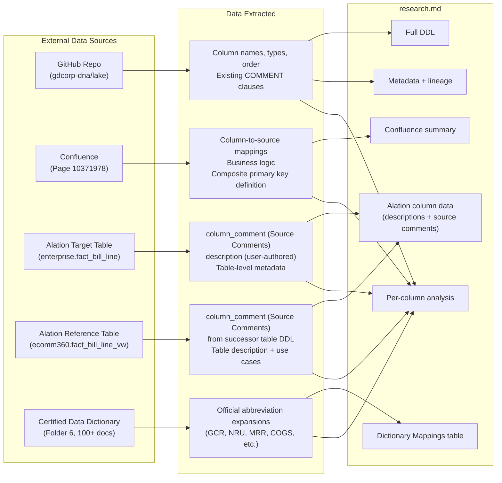
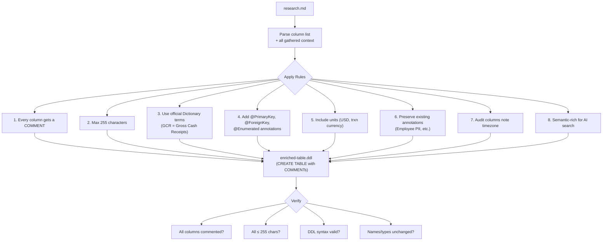
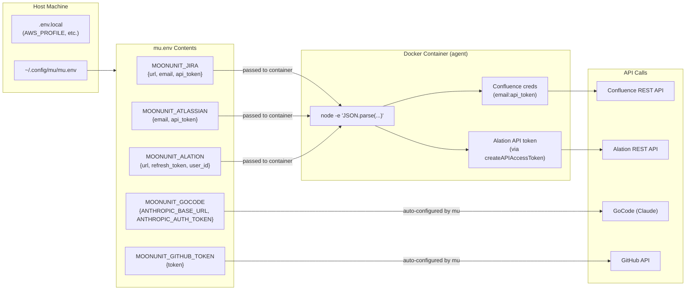

# Column Comments Enrichment — Data Flow Diagram

## End-to-End Data Flow

```mermaid
flowchart TD
    %% User input
    User["User<br>(run.sh)"] -->|"configures target table<br>+ confluence pages"| Config[".env.local<br>+ config.yaml"]

    %% Launch
    Config --> RunSh["run.sh<br>(orchestrator)"]
    MuEnv["~/.config/mu/mu.env<br>(MOONUNIT_* credentials)"] --> RunSh
    RunSh -->|"mu launch --keep-container"| MU["mu CLI<br>(agent runner)"]

    %% Bootstrap
    MU -->|"pulls image + clones repo"| Docker["Docker Container<br>(ephemeral workspace)"]

    %% Stage 1: Research
    subgraph Research["Stage 1: Research"]
        direction TB
        R_DDL["Read table.ddl<br>from cloned repo"]
        R_YAML["Read table.yaml<br>(metadata + lineage)"]
        R_Confluence["Fetch Confluence Page<br>(design spec, column mappings)"]
        R_Alation_Target["Fetch Target Table Columns<br>(description + column_comment)"]
        R_Alation_Ref["Fetch Reference Table Columns<br>(column_comment = Source Comments)"]
        R_Dictionary["Fetch Certified Data Dictionary<br>(official term definitions)"]
        R_Output["research.md<br>(consolidated findings)"]

        R_DDL --> R_Output
        R_YAML --> R_Output
        R_Confluence --> R_Output
        R_Alation_Target --> R_Output
        R_Alation_Ref --> R_Output
        R_Dictionary --> R_Output
    end

    %% Stage 2: Enrich
    subgraph Enrich["Stage 2: Enrich"]
        direction TB
        E_Input["Read research.md"]
        E_Standard["Apply Column Description Standard<br>(255 char limit, annotations,<br>official terminology)"]
        E_Output["enriched-table.ddl<br>(final output)"]

        E_Input --> E_Standard
        E_Standard --> E_Output
    end

    %% Connections
    Docker --> Research
    Research --> Enrich

    %% External data sources
    GitHub["GitHub<br>gdcorp-dna/lake<br>(DDL + table.yaml)"] -->|"git clone"| Docker
    Confluence["Confluence<br>godaddy-corp.atlassian.net<br>(design specs)"] -->|"REST API<br>(MOONUNIT_JIRA creds)"| R_Confluence
    Alation_Tables["Alation<br>Table + Column API<br>(descriptions + source comments)"] -->|"REST API<br>(MOONUNIT_ALATION creds)"| R_Alation_Target
    Alation_Tables -->|"REST API"| R_Alation_Ref
    Alation_Dict["Alation<br>Document Folder 6<br>(Certified Data Dictionary)"] -->|"REST API"| R_Dictionary

    %% Output flow
    Enrich -->|"docker cp"| Output["output/<br>enriched-table.ddl<br>research.md"]
    Output -->|"macOS notification"| User

    %% Styling
    classDef user fill:#4A90D9,stroke:#2C5F8A,color:#fff
    classDef config fill:#F5A623,stroke:#C07D18,color:#fff
    classDef infra fill:#9B6FB0,stroke:#6D4E7D,color:#fff
    classDef external fill:#7BC67E,stroke:#4A8A4D,color:#fff
    classDef stage fill:#E8E8E8,stroke:#999,color:#333
    classDef output fill:#D64541,stroke:#A33330,color:#fff

    class User user
    class Config,MuEnv config
    class RunSh,MU,Docker infra
    class GitHub,Confluence,Alation_Tables,Alation_Dict external
    class Output output
```

## Research Stage — Data Sources Detail

```mermaid
flowchart LR
    subgraph Sources["External Data Sources"]
        S1["GitHub Repo<br>(gdcorp-dna/lake)"]
        S2["Confluence<br>(Page 10371978)"]
        S3["Alation Target Table<br>(enterprise.fact_bill_line)"]
        S4["Alation Reference Table<br>(ecomm360.fact_bill_line_vw)"]
        S5["Certified Data Dictionary<br>(Folder 6, 100+ docs)"]
    end

    subgraph Extracted["Data Extracted"]
        E1["Column names, types, order<br>Existing COMMENT clauses"]
        E2["Column-to-source mappings<br>Business logic<br>Composite primary key definition"]
        E3["column_comment (Source Comments)<br>description (user-authored)<br>Table-level metadata"]
        E4["column_comment (Source Comments)<br>from successor table DDL<br>Table description + use cases"]
        E5["Official abbreviation expansions<br>(GCR, NRU, MRR, COGS, etc.)"]
    end

    S1 --> E1
    S2 --> E2
    S3 --> E3
    S4 --> E4
    S5 --> E5

    subgraph Output["research.md"]
        O1["Full DDL"]
        O2["Metadata + lineage"]
        O3["Confluence summary"]
        O4["Alation column data<br>(descriptions + source comments)"]
        O5["Dictionary Mappings table"]
        O6["Per-column analysis"]
    end

    E1 --> O1
    E1 --> O2
    E2 --> O3
    E3 --> O4
    E4 --> O4
    E5 --> O5
    E1 & E2 & E3 & E4 & E5 --> O6
```

## Enrich Stage — Transformation Rules

```mermaid
flowchart TD
    Input["research.md"] --> Parse["Parse column list<br>+ all gathered context"]

    Parse --> Rules{"Apply Rules"}

    Rules --> R1["1. Every column gets a COMMENT"]
    Rules --> R2["2. Max 255 characters"]
    Rules --> R3["3. Use official Dictionary terms<br>(GCR = Gross Cash Receipts)"]
    Rules --> R4["4. Add @PrimaryKey, @ForeignKey,<br>@Enumerated annotations"]
    Rules --> R5["5. Include units (USD, trxn currency)"]
    Rules --> R6["6. Preserve existing annotations<br>(Employee PII, etc.)"]
    Rules --> R7["7. Audit columns note timezone"]
    Rules --> R8["8. Semantic-rich for AI search"]

    R1 & R2 & R3 & R4 & R5 & R6 & R7 & R8 --> DDL["enriched-table.ddl<br>(CREATE TABLE with COMMENTs)"]

    DDL --> Validate{"Verify"}
    Validate --> V1["All columns commented?"]
    Validate --> V2["All ≤ 255 chars?"]
    Validate --> V3["DDL syntax valid?"]
    Validate --> V4["Names/types unchanged?"]
```

## Credential Flow

```mermaid
flowchart LR
    subgraph Host["Host Machine"]
        EnvLocal[".env.local<br>(AWS_PROFILE, etc.)"]
        MuEnv["~/.config/mu/mu.env"]
    end

    subgraph MuEnvVars["mu.env Contents"]
        MJ["MOONUNIT_JIRA<br>{url, email, api_token}"]
        MA["MOONUNIT_ATLASSIAN<br>{email, api_token}"]
        MAL["MOONUNIT_ALATION<br>{url, refresh_token, user_id}"]
        MG["MOONUNIT_GOCODE<br>{ANTHROPIC_BASE_URL, ANTHROPIC_AUTH_TOKEN}"]
        MGH["MOONUNIT_GITHUB_TOKEN<br>{token}"]
    end

    subgraph Container["Docker Container (agent)"]
        NodeParse["node -e 'JSON.parse(...)'"]
        ConfCreds["Confluence creds<br>(email:api_token)"]
        AlatToken["Alation API token<br>(via createAPIAccessToken)"]
    end

    subgraph APIs["API Calls"]
        ConfAPI["Confluence REST API"]
        AlatAPI["Alation REST API"]
        GoCodeAPI["GoCode (Claude)"]
        GhAPI["GitHub API"]
    end

    MuEnv --> MuEnvVars
    MJ -->|"passed to container"| NodeParse
    MA -->|"passed to container"| NodeParse
    MAL -->|"passed to container"| NodeParse
    NodeParse --> ConfCreds
    NodeParse --> AlatToken
    ConfCreds --> ConfAPI
    AlatToken --> AlatAPI
    MG -->|"auto-configured by mu"| GoCodeAPI
    MGH -->|"auto-configured by mu"| GhAPI
```
