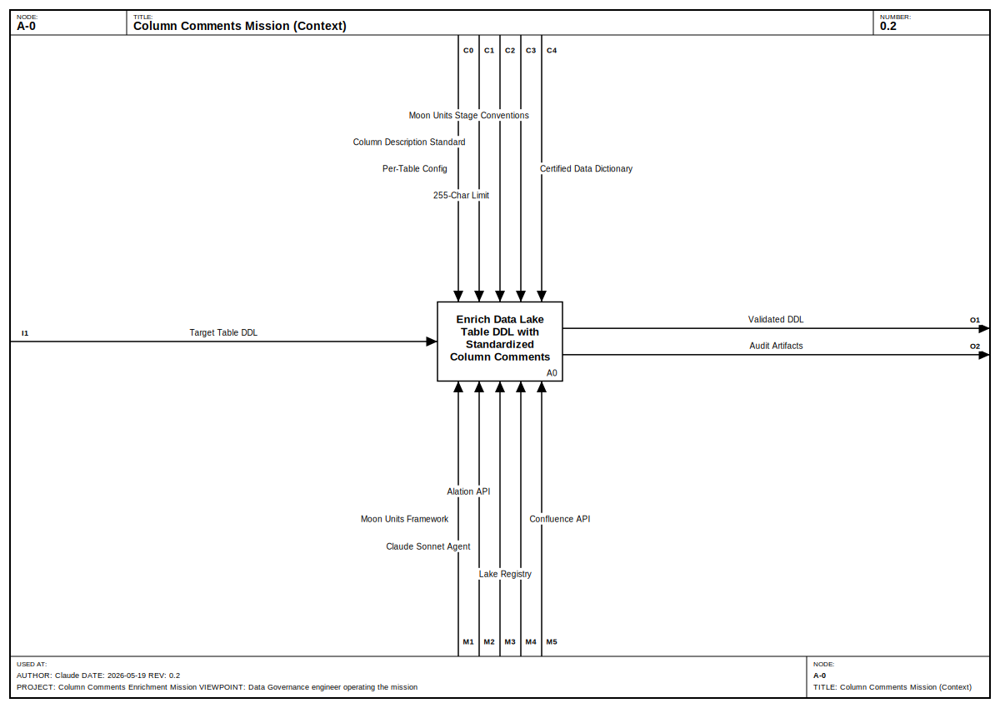
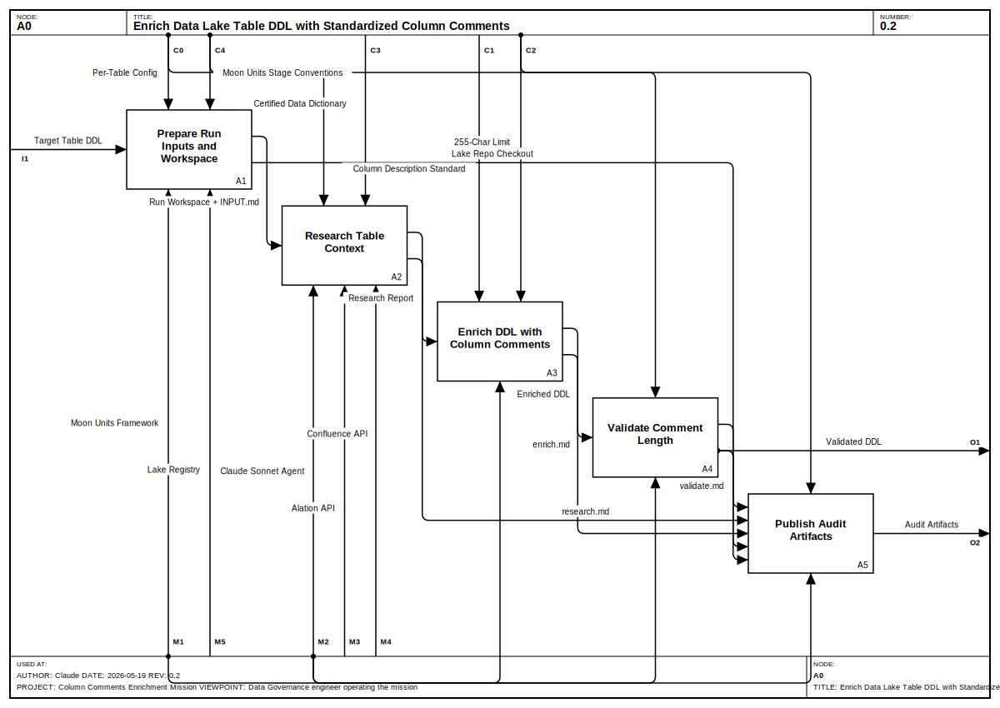
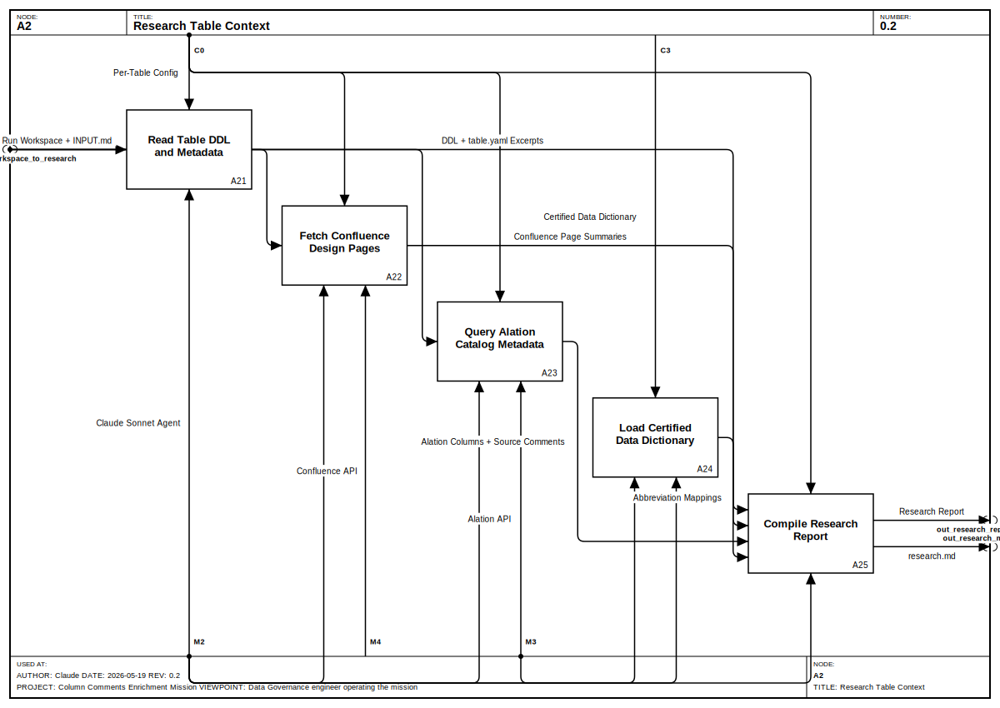

# IDEF0 Model: Column Comments Enrichment Mission

## 1. Purpose and Viewpoint

**Purpose:** Functional decomposition of the Moon Units column-comments mission: how a target Data Lake table's DDL is enriched in place with standardized, ≤255-char COMMENT clauses governed by GoDaddy's Column Description Standard and the Certified Data Dictionary, and how the enriched DDL plus an audit trail are published.


**Viewpoint:** Data Governance engineer operating the mission

## 2. Model Metadata

| Field   | Value          |
|---------|----------------|
| Author  | Claude |
| Date    | 2026-05-19   |
| Version | 0.2 |

## 3. Context Diagram (A-0)




## 4. Decomposition: A0 — Enrich Data Lake Table DDL with Standardized Column Comments



### Activities

| ID | Name | Decomposed In |
|----|------|---------------|
| A1 | Prepare Run Inputs and Workspace | — |
| A2 | Research Table Context | A2 |
| A3 | Enrich DDL with Column Comments | — |
| A4 | Validate Comment Length | — |
| A5 | Publish Audit Artifacts | — |


## 5. Decomposition: A2 — Research Table Context



### Activities

| ID | Name | Decomposed In |
|----|------|---------------|
| A21 | Read Table DDL and Metadata | — |
| A22 | Fetch Confluence Design Pages | — |
| A23 | Query Alation Catalog Metadata | — |
| A24 | Load Certified Data Dictionary | — |
| A25 | Compile Research Report | — |


## 6. Node Index

```
A-0 Column Comments Mission (Context)
  A0 Enrich Data Lake Table DDL with Standardized Column Comments
    A1 Prepare Run Inputs and Workspace
    A2 Research Table Context
      A21 Read Table DDL and Metadata
      A22 Fetch Confluence Design Pages
      A23 Query Alation Catalog Metadata
      A24 Load Certified Data Dictionary
      A25 Compile Research Report
    A3 Enrich DDL with Column Comments
    A4 Validate Comment Length
    A5 Publish Audit Artifacts
```

## 7. Arrow Dictionary

| ID | Label | Type | From | To |
|----|-------|------|------|-----|
| I1 | Target Table DDL | Boundary (Input) | boundary (left) | A0 |
| C0 | Per-Table Config | Boundary (Control) | boundary (top) | A0 |
| C1 | Column Description Standard | Boundary (Control) | boundary (top) | A0 |
| C2 | 255-Char Limit | Boundary (Control) | boundary (top) | A0 |
| C3 | Certified Data Dictionary | Boundary (Control) | boundary (top) | A0 |
| C4 | Moon Units Stage Conventions | Boundary (Control) | boundary (top) | A0 |
| O1 | Validated DDL | Boundary (Output) | A0 | boundary (right) |
| O2 | Audit Artifacts | Boundary (Output) | A0 | boundary (right) |
| M1 | Moon Units Framework | Boundary (Mechanism) | boundary (bottom) | A0 |
| M2 | Claude Sonnet Agent | Boundary (Mechanism) | boundary (bottom) | A0 |
| M3 | Alation API | Boundary (Mechanism) | boundary (bottom) | A0 |
| M4 | Confluence API | Boundary (Mechanism) | boundary (bottom) | A0 |
| M5 | Lake Registry | Boundary (Mechanism) | boundary (bottom) | A0 |
| I1 | Target Table DDL | Boundary (Input) | boundary (left) | A1 |
| C0 | Per-Table Config | Boundary (Control) | boundary (top) | A1, A2 |
| C1 | Column Description Standard | Boundary (Control) | boundary (top) | A3 |
| C2 | 255-Char Limit | Boundary (Control) | boundary (top) | A3, A4 |
| C3 | Certified Data Dictionary | Boundary (Control) | boundary (top) | A2 |
| C4 | Moon Units Stage Conventions | Boundary (Control) | boundary (top) | A1, A5 |
| M1 | Moon Units Framework | Boundary (Mechanism) | boundary (bottom) | A1, A5 |
| M2 | Claude Sonnet Agent | Boundary (Mechanism) | boundary (bottom) | A2, A3, A4 |
| M3 | Alation API | Boundary (Mechanism) | boundary (bottom) | A2 |
| M4 | Confluence API | Boundary (Mechanism) | boundary (bottom) | A2 |
| M5 | Lake Registry | Boundary (Mechanism) | boundary (bottom) | A1 |
| int_workspace_to_research | Run Workspace + INPUT.md | Internal | A1 | A2 |
| int_repo_to_publish | Lake Repo Checkout | Internal | A1 | A5 |
| int_research_to_enrich | Research Report | Internal | A2 | A3 |
| int_research_md | research.md | Internal | A2 | A5 |
| int_enriched_ddl | Enriched DDL | Internal | A3 | A4 |
| int_enrich_md | enrich.md | Internal | A3 | A5 |
| int_validate_md | validate.md | Internal | A4 | A5 |
| O1 | Validated DDL | Boundary (Output) | A4 | boundary (right), A5 |
| O2 | Audit Artifacts | Boundary (Output) | A5 | boundary (right) |
| int_workspace_to_research | Run Workspace + INPUT.md | Boundary (Input) | boundary (left) | A21, A22, A23 |
| C0 | Per-Table Config | Boundary (Control) | boundary (top) | A21, A22, A23, A25 |
| C3 | Certified Data Dictionary | Boundary (Control) | boundary (top) | A24 |
| M2 | Claude Sonnet Agent | Boundary (Mechanism) | boundary (bottom) | A21, A22, A23, A24, A25 |
| M3 | Alation API | Boundary (Mechanism) | boundary (bottom) | A23, A24 |
| M4 | Confluence API | Boundary (Mechanism) | boundary (bottom) | A22 |
| int_ddl_excerpts | DDL + table.yaml Excerpts | Internal | A21 | A25 |
| int_conf_summaries | Confluence Page Summaries | Internal | A22 | A25 |
| int_alation_columns | Alation Columns + Source Comments | Internal | A23 | A25 |
| int_abbrev_mappings | Abbreviation Mappings | Internal | A24 | A25 |
| out_research_report | Research Report | Boundary (Output) | A25 | boundary (right) |
| out_research_md | research.md | Boundary (Output) | A25 | boundary (right) |


## 8. Glossary

| Term | Definition |
|------|------------|
| Target Table DDL | The table.ddl file in gdcorp-dna/lake under catalog/config/prod/.../<db>/<table>/ for the chosen table. |
| Per-Table Config | config/<db>/<table>.yaml — Confluence URLs, reference tables, Alation toggle; consumed by run.sh. |
| Column Description Standard | Data Governance Council ruleset: annotations (@PrimaryKey, @ForeignKey, @Enumerated), units, AI-search phrasing. |
| 255-Char Limit | Hard upper bound on each COMMENT string enforced by the lake DDL contract. |
| Certified Data Dictionary | Alation Document Folder 6 — authoritative term/abbreviation expansions (e.g. GCR = Gross Cash Receipts). |
| Moon Units Stage Conventions | Manifest schema and stage envelope rules (header/body/footer; output: <name>.md). |
| Run Workspace | Bind-mounted .workspace/ where INPUT.md, repos/, and stage .md files live during the run. |
| Lake Repo Checkout | Cloned gdcorp-dna/lake under repos/lake/ inside the run workspace. |
| Research Report | research.md — DDL excerpts, table.yaml metadata, Confluence summaries, Alation columns, dictionary mappings. |
| Enriched DDL | table.ddl rewritten in place with COMMENT clauses on every column. |
| Validated DDL | Enriched DDL after the validate stage's 255-char enforcement pass — the authoritative in-repo file. |
| Audit Artifacts | Per-run output/<db>/<table>/ contents: INPUT.md, research/enrich/validate .md, original/enriched/validated -table.ddl, ddl-comparison.md. |
| Moon Units Framework | mu CLI plus the Docker container that executes the staged manifest pipeline. |
| Claude Sonnet Agent | claude-sonnet-4-6 instance executing a single stage prompt inside the container. |
| Lake Registry | External system: gdcorp-dna/lake Git repository hosted on GitHub; source of the target DDL. |
| Alation API | Catalog REST API used for table/column metadata and Document Folder 6. |
| Confluence API | Atlassian REST API used for BI-space design pages. |

